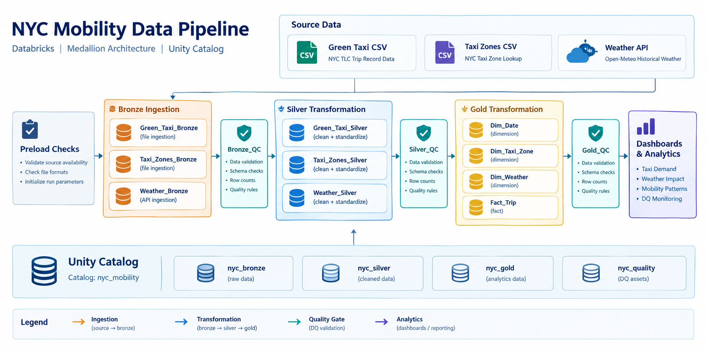

# NYC Mobility Data Pipeline

An end-to-end data engineering pipeline that integrates **NYC Green Taxi trips, weather data, and taxi zone metadata** into trusted, analytics-ready datasets using **Databricks, Delta Lake, PySpark, SQL, and Medallion Architecture**.

The project demonstrates production-oriented data engineering practices including **incremental ingestion, idempotent processing, deduplication, dimensional modeling, data quality validation, and CI/CD workflows**.

---

## 🏗️ Architecture



The pipeline follows a **Bronze → Silver → Gold Medallion Architecture** implemented in Databricks.

| Layer | Purpose |
|---|---|
| **Bronze** | Raw source ingestion with minimal transformation |
| **Silver** | Cleaning, standardization, deduplication, and quality enforcement |
| **Gold** | Analytics-ready fact and dimension tables |
| **Quality** | Data quality and integrity validation across layers |

### Unity Catalog

The project is organized under the `nyc_mobility` catalog:

```text
nyc_mobility
├── nyc_bronze
├── nyc_silver
├── nyc_gold
└── nyc_quality
```

### Gold Data Model

The analytics layer uses a dimensional model centered on taxi trips:

```text
                 ┌─────────────┐
                 │   dim_date  │
                 └──────┬──────┘
                        │
┌──────────────┐   ┌────▼─────────────┐   ┌─────────────────┐
│ dim_taxi_zone├──►│  fact_taxi_trip  │◄──┤  dim_weather    │
└──────────────┘   └──────────────────┘   └─────────────────┘
```

---

## 📊 Data Sources

| Source | Format | Ingestion |
|---|---|---|
| **NYC TLC Green Taxi Trips** | Parquet | File-based ingestion |
| **Open-Meteo Historical Weather** | JSON / REST API | API extraction |
| **NYC Taxi Zone Lookup** | CSV | File ingestion |

The datasets provide:

- Taxi pickup and drop-off activity
- Trip distance and passenger information
- Fare and trip attributes
- Geographic taxi zones
- Temperature and precipitation
- Historical weather conditions

### Source Documentation

- [NYC TLC Trip Record Data](https://www.nyc.gov/site/tlc/about/tlc-trip-record-data.page)
- [Open-Meteo Historical Weather API](https://open-meteo.com/en/docs/historical-weather-api)
- [NYC Taxi Zone Lookup](https://s3.amazonaws.com/nyc-tlc/misc/taxi+_zone_lookup.csv)

---

## 🔄 Pipeline Flow

```text
Source Data
    │
    ▼
┌──────────────┐
│    Bronze    │
│ Raw Ingestion│
└──────┬───────┘
       │
       ▼
┌──────────────┐
│    Silver    │
│ Clean +      │
│ Standardize  │
│ Deduplicate  │
└──────┬───────┘
       │
       ▼
┌──────────────┐
│     Gold     │
│ Fact + Dim   │
│ Tables       │
└──────┬───────┘
       │
       ▼
 Analytics / Dashboards
```

The pipeline is designed to be **repeatable and safe to rerun**, with controls for incremental processing, duplicate prevention, and data quality validation.

---

## ⚙️ Key Engineering Capabilities

### Incremental & Repeatable Processing

- Parameterized processing for time-based taxi data
- Date-range extraction for weather data
- Reloadable reference data
- Idempotent pipeline execution
- Duplicate prevention across repeated runs

### Data Quality & Integrity

- Validation across Bronze, Silver, and Gold
- Schema and field-level checks
- Deduplication controls
- At-rest integrity validation
- Monitoring tables for quality results

### Analytics Modeling

- Fact/dimension dimensional model
- Conformed date and geographic dimensions
- Weather dimension for mobility analysis
- Analytics-ready Gold datasets

### Deployment & Engineering Workflow

- Databricks Asset Bundles (DAB)
- GitHub-based development workflow
- Pull request validation
- Automated repository checks
- Code formatting and linting

---

## 📁 Repository Structure

The repository uses a **domain-first source structure**, while maintaining Bronze/Silver/Gold processing within each domain.

```text
NYC-Mobility/
│
├── src/
│   ├── green_taxi/
│   │   ├── bronze/
│   │   ├── silver/
│   │   └── gold/
│   │
│   ├── weather/
│   │   ├── bronze/
│   │   ├── silver/
│   │   └── gold/
│   │
│   ├── taxi_zones/
│   │   ├── bronze/
│   │   ├── silver/
│   │   └── gold/
│   │
│   └── shared/
│       ├── 00_schema_setup.sql
│       ├── 01_bronze_tables.sql
│       ├── 02_silver_tables.sql
│       ├── 03_gold_tables.sql
│       └── 04_monitoring_tables.sql
│
├── dashboards/
├── docs/
├── resources/
├── tests/
│
├── .github/
├── databricks.yml
├── pyproject.toml
└── README.md
```

Each domain owns its Bronze, Silver, and Gold processing logic, while `src/shared/` contains centralized schema, table, and monitoring definitions.

---

## 🛠️ Technology Stack

### Data Engineering

- **Databricks**
- **Delta Lake**
- **PySpark**
- **SQL**
- **Unity Catalog**

### Data Sources

- **NYC TLC Trip Record Data**
- **Open-Meteo Historical Weather API**
- **NYC Taxi Zone Lookup**

### Development & Quality

- **GitHub**
- **GitHub Actions**
- **SQLFluff**
- **Black**
- **Flake8**
- **isort**
- **nbqa**
- **nbstripout**

---

## 📈 Analytics Use Cases

The resulting Gold datasets support analysis such as:

- **Taxi demand by time and location**
- **Weather impact on taxi activity**
- **Mobility patterns across NYC**
- **Data quality monitoring**

Example analytical questions:

> When and where is taxi demand highest?

> How does weather affect taxi demand?

> Which NYC locations show the strongest mobility activity?

---

## 📚 Documentation

The README intentionally focuses on the **project overview, architecture, engineering approach, and implementation highlights**.

Detailed design decisions and specifications are documented separately in [`docs/`](docs/):

| Document | Purpose |
|---|---|
| [`01_business_rules.md`](docs/01_business_rules.md) | Business assumptions and transformation rules |
| [`02_grain_definitions.md`](docs/02_grain_definitions.md) | Fact and dimension grain definitions |
| [`03_table_specs.md`](docs/03_table_specs.md) | Table specifications and data dictionary |
| [`04_data_model.md`](docs/04_data_model.md) | ERD, schema design, and modeling decisions |
| [`05_data_quality.md`](docs/05_data_quality.md) | Data quality framework and validation rules |
| [`06_engineering_standards.md`](docs/06_engineering_standards.md) | Repository standards, GitHub Actions, and development workflow |

---

## 🔀 Development Workflow

Changes follow a pull request-based development workflow with automated validation:

```text
Feature Branch
      │
      ▼
Pull Request
      │
      ▼
Automated Checks
      │
      ├── Repository Validation
      ├── SQL / Python Quality Checks
      └── Workflow Validation
      │
      ▼
Reviewer Approval
      │
      ▼
Merge to Main
```

This keeps code changes reviewable and provides automated checks before changes reach the main branch.

Repository automation includes:

- Automatic reviewer assignment
- Repository validation checks
- CI validation for Python, SQL, notebooks, tests, and the Databricks bundle
- Staging deployment through the Databricks bundle after changes reach `feature/staging-part-2`
- Branch protection rules
- Standardized code review process

The CI workflow is defined in `.github/workflows/ci.yaml`. It runs on pull
requests and pushes for relevant source, test, configuration, and workflow
changes. The deployment workflow is defined in `.github/workflows/deploy.yaml`;
it validates, deploys, and runs the `NYC_Mobility` Databricks job against the
`dev` bundle target after a successful push to `feature/staging-part-2`.

The `staging` GitHub Environment must provide `DATABRICKS_HOST` and
`DATABRICKS_TOKEN` secrets.

---

## 📌 Project Status

The current implementation focuses on validating the **end-to-end architecture and engineering patterns** using an initial dataset, with the repository structured to support further expansion.

### Implemented

- Multi-source data ingestion
- Bronze, Silver, and Gold Medallion layers
- Incremental and repeatable processing
- Idempotent pipeline execution
- Deduplication and standardization
- Data quality validation
- Dimensional data modeling
- Unity Catalog organization
- Databricks Asset Bundle deployment structure
- GitHub Actions and repository validation workflow

### Next Steps

- Expand the initial dataset coverage
- Extend analytical dashboards
- Add further mobility data sources
- Expand automated data quality monitoring
- Increase test coverage as the pipeline grows

---

## 🎯 Project Goal

NYC Mobility demonstrates how disparate public datasets can be transformed into a **reliable, governed, and analytics-ready data platform** using modern data engineering practices.

The project emphasizes not only the final datasets, but also the engineering principles required to make pipelines **repeatable, maintainable, testable, and trustworthy**.